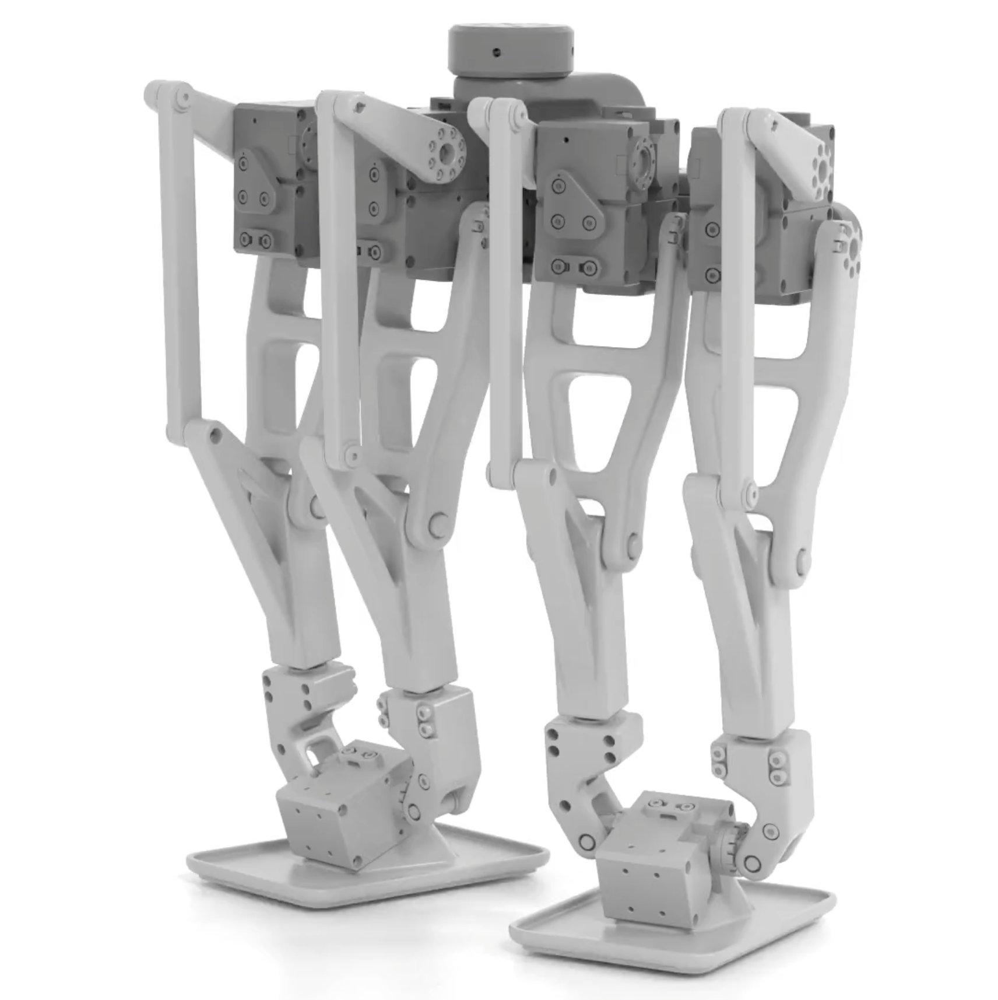

# DR Legs



## Description
DR Legs (a.k.a. Dr. Legs) is a bipedal walking robot with a serial-parallel hybrid leg mechanism that exhibits both passive
and actuated joints with multiple closed kinematic loops, originally presented by Gim et al. in [**[1]**](#relevant-literature).


## Changelog

### [01/11/2025]
- Initial release.


## Assets

The following assets are provided for this model:

| filename | type | description |
|---|---|---|
| `usd/Geometry/surfaces.usd` | USD (binary) | The set of rigid body surface geometry as a instanceable set of `UsdGeom` meshes. |
| `usd/dr_legs.usda` | USD (text) | The default model of **DR Legs** as a `UsdPhysics` scene with full high-resolution mesh geometry. |
| `usd/dr_legs_with_boxes.usda` | USD (text) | A simplified version of **DR Legs** with box primitive geometry for the pelvis and feet. |
| `usd/dr_legs_with_meshes_and_boxes.usda` | USD (text) | A hybrid version of **DR Legs** with full mesh geometry as well as box primitive geometry for the pelvis and feet. |
| `animation/dr_legs_animation_100fps.npy` | `numpy` (binary) | Array containing a walking animation parameterized in joint-space and time-discretized at `dt=0.01s`, i.e. `100Hz` |


## Relevant Literature

**[1]** The original publication describing the design of **DR Legs** should be cited ([Gim et al., 2018 IROS](https://ieeexplore.ieee.org/document/8594182)):
```bibtex
@article{Gim:2018,
    author={Gim, Kevin G. and Kim, Joohyung and Yamane, Katsu},
    booktitle={2018 IEEE/RSJ International Conference on Intelligent Robots and Systems (IROS)},
    title={Design and Fabrication of a Bipedal Robot Using Serial-Parallel Hybrid Leg Mechanism},
    year={2018},
    doi={10.1109/IROS.2018.8594182}
}
```

This model also appears in the following works:

**[2]** Our work on inverse kinematics and motion retargeting for general mechanisms featuring closed kinematic loops ([Schumacher et al., 2021 IEEE-RA-L](https://ieeexplore.ieee.org/document/9343702)):
```bibtex
@article{Schumacher:2021,
    author={Schumacher, Christian and Knoop, Espen and Bächer, Moritz},
    journal={IEEE Robotics and Automation Letters},
    title={A Versatile Inverse Kinematics Formulation for Retargeting Motions Onto Robots With Kinematic Loops},
    year={2021},
    doi={10.1109/LRA.2021.3056030}
}
```

**[3]** Our work on neural augmentation of robot simulations ([Serifi et al., 2023 IEEE-RA-L](https://ieeexplore.ieee.org/document/10113169)):
```bibtex
@article{Serifi:2023,
    author={Serifi, Agon and Knoop, Espen and Schumacher, Christian and Kumar, Naveen and Gross, Markus and Bächer, Moritz},
    journal={IEEE Robotics and Automation Letters},
    title={Transformer-Based Neural Augmentation of Robot Simulation Representations},
    year={2023},
    doi={10.1109/LRA.2023.3271812}
}
```

**[4]** Our technical report on constrained rigid-body dynamics solvers ([Tsounis et al., 2025 arXiv](https://arxiv.org/abs/2504.19771)):
```bibtex
@article{Tsounis:2025,
    title={On Solving the Dynamics of Constrained Rigid Multi-Body Systems with Kinematic Loops},
    author={Vassilios Tsounis and Ruben Grandia and Moritz Bächer},
    year={2025},
    eprint={2504.19771},
    archivePrefix={arXiv},
    primaryClass={cs.RO},
    url={https://arxiv.org/abs/2504.19771},
}
```

----
Copyright (C) 2025, Disney Enterprises, Inc. All rights reserved.
