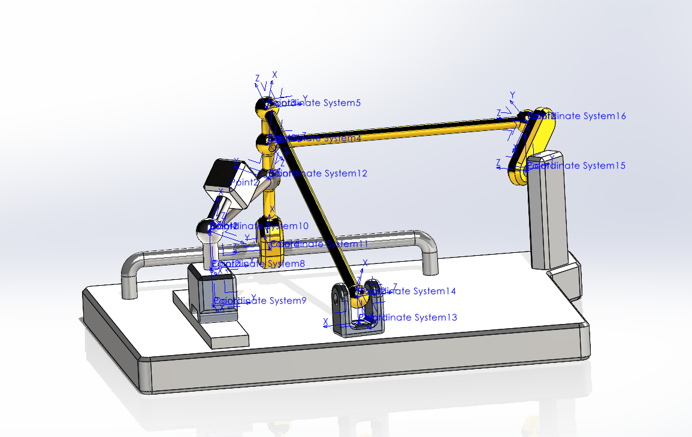

# DR Test Mechanism



## Description
DR Test Mechanism (a.k.a. DR TestMech) is a teeny-tiny toy mechanism that serves as a demonstration of all joints supported by Kamino.


## Changelog

### [01/11/2025]
- Initial release.


## Assets

The following assets are provided for this model:

| filename | type | description |
|---|---|---|
| `usd/Geometry/surfaces.usd` | USD (binary) | The set of rigid body surface geometry as a instanceable set of `UsdGeom` meshes. |
| `usd/dr_testmech.usda` | USD (text) | The model of **DR Test Mechanism** as a `UsdPhysics` scene with full high-fidelity mesh geometry. |


## Relevant Literature

This model appears in the following works:

**[1]** Inverse kinematics and motion retargeting for general mechanisms featuring closed kinematic loops ([Schumacher et al., 2021 IEEE-RA-L](https://ieeexplore.ieee.org/document/9343702)):
```bibtex
@article{Schumacher:2021,
    author={Schumacher, Christian and Knoop, Espen and Bächer, Moritz},
    journal={IEEE Robotics and Automation Letters},
    title={A Versatile Inverse Kinematics Formulation for Retargeting Motions Onto Robots With Kinematic Loops},
    year={2021},
    doi={10.1109/LRA.2021.3056030}
}
```

----
Copyright (C) 2025, Disney Enterprises, Inc. All rights reserved.
