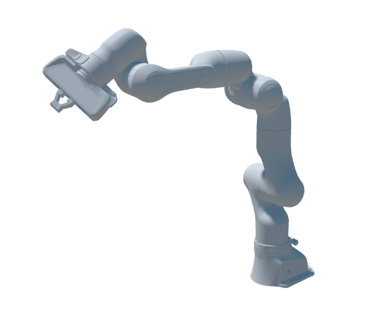

# Franka Emika Panda Simulation Assets

## Overview

This folder contains robot assets for the Franka Emika Panda developed by [Franka Robotics](https://franka.de/).

## Sources

### URDF

The URDF and mesh files were retrieved from the [franka_description](https://github.com/frankarobotics/franka_description) repository at d9841cf.
The URDFs were generated using the script in the repository:
- The `--no-ee` option was used to generate URDFs without `franka_hand` in their name.

The mesh paths were updated to match the asset folder name.

## License

This model is released under the [Apache 2.0 License](LICENSE).
